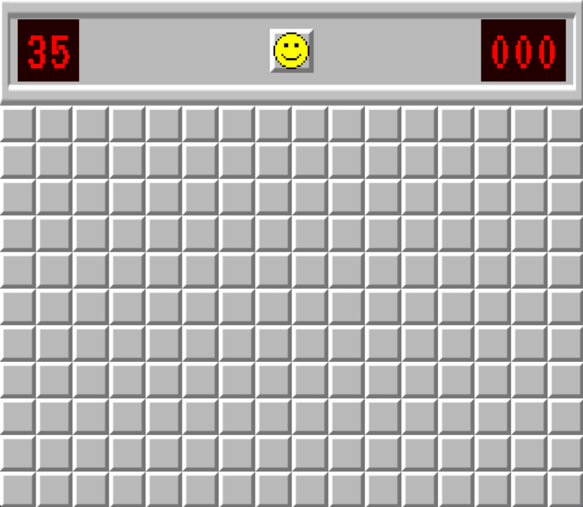
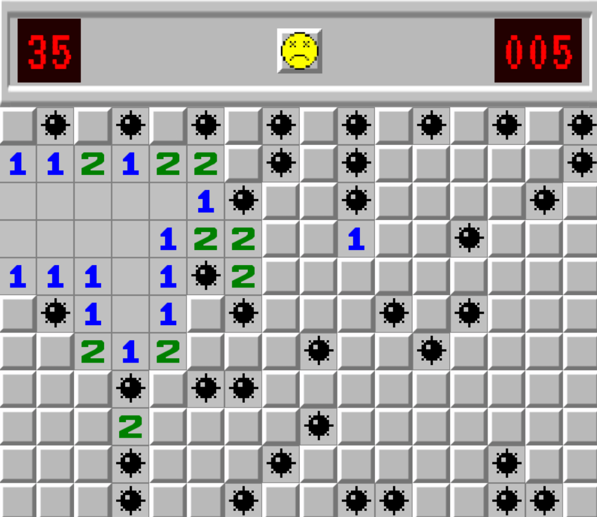

# Minesweeper
A simple game made in [SDL2](https://www.libsdl.org/) with C++.

## Screenshots



## Compiling
### Windows
After installing Mingw64, [SDL2](https://github.com/libsdl-org/SDL/releases/tag/release-2.30.10), [SDL_Image](https://github.com/libsdl-org/SDL_image), and [SDL_TTF](https://github.com/libsdl-org/SDL_ttf), execute the following command in the project's root directory:

```
  g++ -Iinclude -Iinclude/SDL2 -Iinclude/headers -Llib -o Main src/*.cpp -lmingw32 -lSDL2main -lSDL2 -lSDL2_image -lSDL2_ttf 
```

Compiled file should be located in project root directory, `ready to run`.

## Assets
- [MINE-SWEEPER](https://fontstruct.com/fontstructions/show/1501665) font was made by `Gangetsha Lyx`,
- [VT323](https://fonts.google.com/specimen/VT323) font made by `Peter Hull`,
- Some of the code was taken from a `SDL2 tutorial` series by [codergopher](https://www.youtube.com/@codergopher8270)